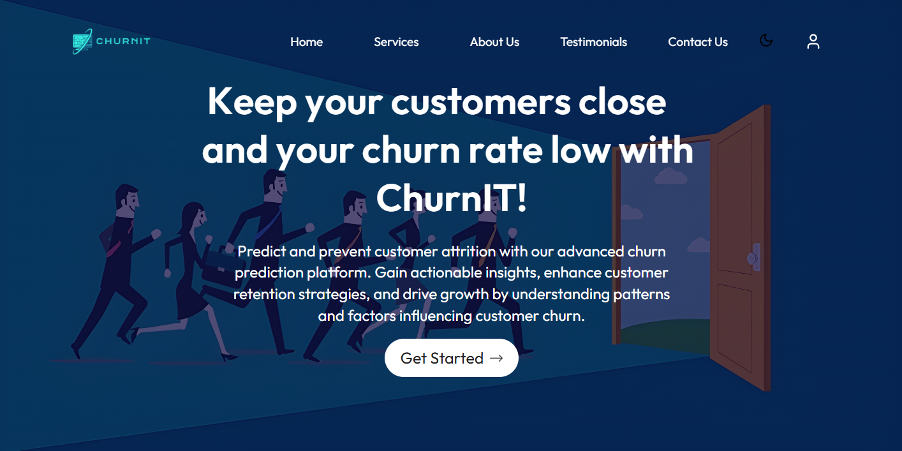

# 📱 ChurnIT: Customer Churn Predictor

An end-to-end machine learning and web platform designed to predict and mitigate customer churn in the telecommunications sector of Nepal. Built as part of a Bachelor of Engineering in Computer Engineering minor project at Kathmandu Engineering College, Tribhuvan University.

## 🔗 Project Overview

Customer churn poses a significant financial liability in telecom networks due to steep customer acquisition costs. **ChurnIT** leverages state-of-the-art predictive modeling to flag at-risk subscribers based on behavioral characteristics (such as contract structures, payment configurations, and account tenure), allowing providers to deploy automated, targeted customer retention strategies.

---

## 🎨 System Walkthrough & Dashboard Interface

### 1. Landing & Executive Portal

An AI-powered B2B interface built to onboard corporate datasets and monitor lifecycle engagement trends.


### 2. Live Predictive Scoring Pipeline

A clean operational input interface where account managers can review automated machine learning scores, feature risk flags, and real-time retention workflow prompts.
| Client Login Pathway |Google Authentication Window |
|---|---|
|  |  |

---

## ⚙️ Engineering Architecture & Process Flow

The project adopts an **Iterative Software Development Model**, implementing continuous deployment loops spanning requirement analysis, structural modeling, implementation, and target validation.

```text
[Data Sourcing] ➔ [Pandas Preprocessing & One-Hot Encoding] ➔ [Feature Scaling] ➔ [Model Evaluation (RF / XGBoost)] ➔ [Flask/Django App Deployment]
System Processing Block Diagram
The underlying framework partitions incoming customer dimensions into scaled data matrices, flowing systematically into our production classifiers:

                  +-------------------------+
                  |    Raw Data Sources     |
                  +------------+------------+
                               |
                               v
                  +------------+------------+
                  |  Data Loading & Import  |
                  +------------+------------+
                               |
                               v
+------------------------------+------------------------------+
|                      DATA PREPROCESSING                     |
|[Data Scrubbing] ➔ [Feature Selection] ➔ [One-Hot Encoding] |
+------------------------------+------------------------------+
                               |
                               v
                  +------------+------------+
                  |     Feature Scaling     |
                  +------------+------------+
                               |
                               v
                  +------------+------------+
                  |  Data Splitting (80/20) |
                  +------+------------+-----+
                         |            |
                         v            v
                  +------+---+    +---+------+
                  |Train Set |    | Test Set |
                  +------+---+    +---+------+
                         |            |
                         v            |
                  +------+---+        |
                  |  Models  |        |
                  +------+---+        |
                         |            |
                         v            v
                  +------+------------+-----+
                  |   Ensemble Prediction   |
                  +------------+------------+
                               |
                               v
                  +------------+------------+
                  |     System Output       |
                  +-------------------------+

🛠️ Complete Technology Stack
Backend Core Engine: Python, Django / Flask

Frontend UI Application: React, JavaScript, HTML5, CSS3

Data Science Pipeline: Scikit-learn (sklearn), Pandas, NumPy

Gradient Optimization Engines: XGBoost, LightGBM

Foundational Knowledge Engine: Google Generative AI Library (for context-aware retention messaging models)

Exploratory Graphing Components: Matplotlib, Seaborn

Data Engineering Environment: Kaggle Platforms

🧬 Explored Features & Dimensional Analysis
The engine evaluates 7,043 subscriber records across 21 core behavioral variables, including:

Demographic Weights: Gender, Senior Citizen Status, Dependents, Partner Flags.

Account Tenure & Engagements: Total subscription length (Tenure), Contract Category (Month-to-month, 1-Year, 2-Year).

Service Subscriptions: Phone Lines, Internet Topology (DSL/Fiber Optic), Online Security add-ons, TechSupport access, Media Streaming.

Transactional Accounting: Monthly Charges, Cumulative Ledger Records (Total Charges), Payment Vectors.

Statistical Correlations & Predictive Insights
Long-Term Contracts (-0.40)  ───► Strongly Minimizes Attrition Risk
TechSupport Access  (-0.29)  ───► Lowers Churn Propensity
Online Security     (-0.28)  ───► Mitigates Attrition Risk
High Monthly Costs   (+0.19)  ───► Amplifies Churn Propensity

🧠 Model Training & Performance Evaluation
The dataset was segmented using an 80/20 train/test partition to ensure optimal generalized learning boundaries. To benchmark operational efficiency, we compared a baseline Random Forest Classifier against a sequentially trained eXtreme Gradient Boosting (XGBoost) framework:

1. Random Forest Performance (Top Performer)
Classification Accuracy: 96.23%

Precision: 96.03%

Recall: 96.67%

F1-Score: 96.35%

Area Under Curve (AUC): 0.993

2. XGBoost Framework Performance
Classification Accuracy: 95.03%

Precision: 94.00%

Recall: 96.50%

F1-Score: 95.24%

Area Under Curve (AUC): 0.990

Feature Importance Interpretations
Both predictive models identified Contract Term Boundaries as the single most critical structural node deciding customer loyalty, followed immediately by Tenure length and Monthly Financial Overhead Commitments.
```
